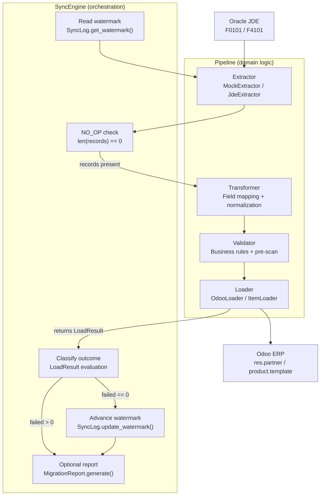

# JDE-Odoo Migration Toolkit

> Status: Prototype — architecture validated against synthetic data.
> Oracle JDE extractor pending real environment access.

**ETL and incremental sync engine for migrating Oracle JDE master data to Odoo ERP.
Designed to handle real-world migration constraints: idempotency, partial failures, temporal inconsistencies, and referential integrity. Currently validated in a single-node prototype environment against synthetic data.**

---

## Table of Contents

- [Executive Summary](#executive-summary)
- [Tech Stack](#tech-stack)
- [Architecture Overview](#architecture-overview)
- [Core Design Decisions](#core-design-decisions)
- [Pipeline Architecture](#pipeline-architecture)
- [Sync Engine Design](#sync-engine-design)
- [Data Mapping Strategy](#data-mapping-strategy)
- [Validation Strategy](#validation-strategy)
- [Reporting and Observability](#reporting-and-observability)
- [Known Limitations](#known-limitations)
- [Project Structure](#project-structure)
- [Running the Project](#running-the-project)
- [Engineering Challenges and Solutions](#engineering-challenges-and-solutions)
- [Data Disclaimer](#data-disclaimer)
- [Future Improvements](#future-improvements)

---

## Executive Summary

ERP migrations are often treated as data movement problems. In practice, the primary challenges are restartability under partial failure, correctness of incremental sync across incompatible temporal models, and preserving referential integrity across deployment-specific domains. This system addresses those constraints explicitly through idempotent writes, composite watermarking, and deterministic validation.

Naive ETL scripts fail in predictable and compounding ways. Without idempotency at the write layer, partial runs create duplicates on restart. Without composite watermarking, incremental sync loses records updated multiple times within the same Julian date. Without batch-level pre-scan, duplicate keys corrupt both records silently instead of rejecting both explicitly. Without a separation between validation logic and orchestration logic, adding a new source table requires modifying core pipeline code.

This system migrates Oracle JDE F0101 Address Book records to Odoo `res.partner` and F4101 Item Master records to Odoo `product.template` via XML-RPC, designed with the following properties: idempotent loads keyed on business identifiers, UPMJ+UPMT watermark-based incremental extraction, deterministic validation with no network calls inside the validator, a frozen UomRegistry shared between validator and loader, atomic stop-on-failure batching with full restart safety, and a four-sheet Excel reconciliation report generated per run. The SyncEngine orchestrates any pipeline that implements `BasePipeline` — adding a new JDE table requires one new pipeline class and zero changes to orchestration.

The validation rules, failure modes, and data quality decisions encoded in this system are derived from direct experience with manual JDE to Odoo migration work. This system encodes those real-world data cleaning decisions into deterministic, testable rules — translating domain knowledge into automation rather than generic ETL patterns.

---

## Tech Stack

| Layer                  | Technology                              | Role                                                  | Reason                                                                                                            |
| ---------------------- | --------------------------------------- | ----------------------------------------------------- | ----------------------------------------------------------------------------------------------------------------- |
| Runtime                | Python 3.13                             | Pipeline execution, XML-RPC client                    | Native `xmlrpc.client`, dataclasses, `abc`, strong typing support                                                 |
| Configuration          | Pydantic Settings (`pydantic-settings`) | Typed environment variable loading from `.env`        | Validates types at startup; a misconfigured `DRY_RUN` raises `ValidationError` before any pipeline stage executes |
| Data extraction (dev)  | pandas                                  | CSV read with `dtype=str` to prevent numeric coercion | Preserves phone numbers and zip codes as strings; NaN cleanup is explicit and traceable                           |
| Data extraction (prod) | python-oracledb                         | Oracle JDE thin-mode connection                       | Pure Python; no Oracle Instant Client required in thin mode; supports bind parameters for query plan caching      |
| Odoo integration       | xmlrpc.client (stdlib)                  | XML-RPC calls to Odoo `/xmlrpc/2/object`              | No third-party Odoo client dependency; direct protocol control                                                    |
| Persistence            | SQLite (`sqlite3` stdlib)               | Transaction log and watermark store                   | Zero-dependency, file-based; suitable for single-host pipeline execution; no infrastructure required              |
| Reporting              | openpyxl                                | Four-sheet Excel report generation                    | Programmatic column formatting, Text number format enforcement, cell-level fill and font control                  |
| Testing                | pytest                                  | Unit and integration test suite                       | Fixture-based isolation; `tmp_path` for SQLite test databases; mock registry injection                            |
| Mocking                | `unittest.mock`                         | Mock Odoo XML-RPC proxies and pipeline components     | Keeps tests infrastructure-free; UomRegistry tested with controlled `execute_kw` return values                    |
| CI                     | GitHub Actions                          | Automated test execution on push and PR               | Pinned action versions; Python 3.13; artifact upload for test cache                                               |

---

## Architecture Overview

The system enforces a hard boundary between two layers: pipelines own domain logic, SyncEngine owns orchestration logic.

A **pipeline** owns everything specific to one JDE table: which extractor to use, how to transform raw fields into Odoo format, which business rules apply, which Odoo model to write to, which domain registries to build, and how to compute a new watermark from the extracted records. `CustomerPipeline` knows what AN8, AT1, and PH1 mean. `ItemPipeline` knows what ITM, STKT, UOM1, and SRP1 mean.
No component outside the pipeline layer is aware of these field names.

**SyncEngine** owns everything that is domain-agnostic: reading the current watermark from `SyncLog`, detecting NO_OP conditions before invoking any pipeline stage, invoking transform and validate and load in sequence, advancing the watermark only on clean runs, classifying the outcome, and optionally triggering report generation. SyncEngine never reads a JDE field name. It receives any object implementing `BasePipeline` and calls the same interface regardless of which table is being processed.

This separation means the orchestration layer is tested once with mock pipelines and never needs to change when new tables are added.



---

## Core Design Decisions

### Idempotency via Business Keys at the Write Layer

Idempotency is enforced at the point of write, not in a pre-run check. Before every `create` call, the loader searches Odoo by business key: for customers, AN8 is stored in the `ref` field and searched before every partner create; for items, ITM is stored in `default_code` and searched before every product create. If the record already exists — whether created by this pipeline in a previous run or created outside it — no duplicate is produced and the result is logged as LOADED.

The transaction log skip (`_get_loaded_an8s`, `_get_loaded_itms`) is a performance optimization on top of this guarantee. It avoids XML-RPC round trips for records confirmed loaded in a previous run. It is not the source of idempotency. The Odoo existence check is the source of idempotency, and it runs unconditionally for any record not already in the transaction log.

The validator does not perform existence checks. That responsibility belongs to the loader because the answer can change between validation and load time, and because making the validator perform network calls would destroy its determinism guarantee.

### Watermark Design: UPMJ + UPMT Composite

JDE's last-modified timestamp is split across two fields: UPMJ (Julian date as an integer, format `CYYDDD` offset from 1900) and UPMT (time of day in seconds). Using UPMJ alone as a watermark creates a correctness gap: multiple records modified on the same Julian date share the same UPMJ value. A batch that processes some of those records and then fails would advance the watermark to that UPMJ, causing the remaining records to fall below the watermark on restart and be silently skipped.

The composite filter condition is `(UPMJ > last_upmj) OR (UPMJ == last_upmj AND UPMT > last_upmt)`. This correctly handles records modified on the same date by using UPMT as a tiebreaker. Records with unparseable or missing UPMJ/UPMT values are included rather than excluded — silent data loss is a worse failure mode than processing a record twice.

Watermark computation is delegated to the pipeline via `compute_watermark(records, current)`. SyncEngine passes the raw extracted records and current watermark, receives a new `SyncWatermark`, and persists it. SyncEngine never reads UPMJ or UPMT directly.

### NO_OP Handling

In a scheduled sync context, most executions find zero new records. SyncEngine exits immediately after extraction if `len(records) == 0`, returns `SyncOutcome.NO_OP` with exit code 0, and does not call transform, validate, load, or advance the watermark. The watermark does not advance because the maximum timestamp in the batch is undefined when there are no records, and calling downstream stages with an empty list produces misleading log output.

### Batch Pre-scan Validation

Two validation problems cannot be detected at the individual record level and require a full-batch pass before per-record validation begins.

Duplicate key detection: when the same AN8 or ITM appears more than once in a batch, both occurrences must be rejected, not just the second. Accepting the first occurrence would silently load data of unknown correctness. The pre-scan builds a frequency map, identifies all keys with count > 1, and the per-record validator rejects any record whose key appears in that set.

Unknown UOM detection: all unique UOM codes across the full batch are checked against the registry before per-record validation. This produces a single actionable warning listing every code that needs to be added to `uom_mapping.csv`, rather than repeating the same per-record error for every affected item.

### Registry Pattern: UomRegistry

The Odoo XML-RPC payload for `product.template` requires integer IDs for `uom_id`. These IDs are instance-specific — they differ between Odoo deployments and cannot be determined from the JDE data alone. The transformer cannot resolve them because it has no Odoo connection and must remain infrastructure-free. The validator must not resolve them via network calls because that would break determinism.

UomRegistry is built once at pipeline initialization: it calls Odoo `search_read` on `uom.uom` to fetch all IDs and names, loads the JDE→Odoo name and category mapping from `config/uom_mapping.csv`, cross-references them, and builds a frozen dict of `JDE code → UomRecord(id, name, category_id, category)`. From that point forward, both the validator (`is_resolvable`, `resolve`) and the loader (`resolve(code).id`) use pure dict lookups. No network calls occur during record processing.

The `category` field in `UomRecord` comes from the mapping CSV, not from Odoo. This is a compatibility decision: Odoo saas-19.2 removed `category_id` from the `uom.uom` XML-RPC API. Sourcing category from the CSV makes the registry version-independent and fully deterministic.

### Deterministic Validation

The validator receives an injected, frozen UomRegistry at construction time. During `validate_batch()`, it makes no external calls of any kind. The same input records always produce the same valid/failed split, regardless of the current state of Odoo, the database, or the network. This makes the validator unit-testable with a mock registry and failures reproducible without infrastructure.

---

## Pipeline Architecture

### Customer Pipeline: F0101 → res.partner

`CustomerPipeline` assembles `MockExtractor` (or `JdeExtractor` for `--source oracle`), `CustomerTransformer`, `CustomerValidator`, and `OdooLoader` (or `CsvLoader` in dry-run mode).

**CustomerTransformer** handles the following field-level concerns: AN8 is parsed to integer and stored as `_jde_an8`; AT1 is mapped to `customer_rank` (1 for `C`, 0 for all others) and also preserved as `_jde_at1` for Rule 4; phone numbers are stripped of spaces and dashes via regex while preserving the `+` prefix and digit structure for format validation downstream; PA8=`"0"` (JDE's no-parent sentinel) is mapped to None; UPMJ is converted from Julian integer to ISO date string for the audit comment field. The transformer does not validate — it passes through malformed data so the validator can report it with a specific rule reference.

**CustomerValidator** enforces 8 rules in sequence, returning on the first failure: AN8 present, AN8 unique in batch (pre-scan), name non-empty, AT1 in `{C, V, E}`, phone present and matching Philippine mobile (`09XXXXXXXXX` or `+639XXXXXXXXX`) or landline (`0XXXXXXXXX` or `+63XXXXXXXXX`) pattern via compiled regex, street non-empty, city non-empty, zip numeric if present.

**OdooLoader** operates atomically. It searches Odoo by `ref=str(AN8)` before every create. On failure, it marks all remaining records NOT_PROCESSED, sets `batch_stopped=True`, and stops processing. It logs every record outcome to SQLite with batch_id, attempt number, AN8, status, Odoo ID, and error message.

### Item Pipeline: F4101 → product.template

`ItemPipeline` assembles the item stack and owns `UomRegistry` construction. In live mode it authenticates with Odoo and builds the registry from live data. In dry-run mode it builds the registry from `uom_mapping.csv` using mock Odoo records with sequential IDs, allowing the full validation path to execute without an Odoo connection.

**ItemTransformer** maps STKT to Odoo `type` (`S`→`consu`, `N`→`consu`, `O`→`service`) and derives `sale_ok`/`purchase_ok` flags from `STKT_BEHAVIOR`: outside operation items (`O`) have `sale_ok=False, purchase_ok=True`. UOM codes are uppercased and preserved as JDE strings — the transformer does not resolve them to Odoo IDs. SRP1 is parsed to float; empty or None values produce None, not 0.0, because 0.0 is a semantically valid price and should not be the default for missing data.

**ItemValidator** enforces 9 rules: ITM present, positive, and parseable as integer; ITM unique in batch (pre-scan); name non-empty; STKT in `{S, N, O}`; UOM1 present and resolvable in registry; UOM2 resolvable if present; UOM1 and UOM2 in the same category if both present; `list_price` non-negative if present; STKT=`O` items must have UOM1 in `SERVICE_COMPATIBLE_CATEGORIES` (`{Unit, Time, Working Time, Unit of Time}`), catching semantically wrong combinations like a service item measured in kilograms.

**ItemLoader** resolves UOM codes to integer IDs at payload build time via `uom_registry.resolve(code).id`. It sets `default_code=str(ITM)` as the idempotency key and searches Odoo by `default_code` before every create. The `uom_po_id` field is omitted from payloads because the `purchase_uom` module is not installed on the target Odoo instance.

---

## Sync Engine Design

### Orchestration Responsibilities

SyncEngine is the only component that reads from and writes to `SyncLog`. It is responsible for: reading the watermark before extraction, short-circuiting on NO_OP, calling transform → validate → load through the pipeline interface, computing the new watermark via the pipeline's `compute_watermark()`, persisting the new watermark only on clean runs, classifying the outcome, and calling `MigrationReport.generate()` if `--report` is set.

SyncEngine holds no domain knowledge. It does not know what UPMJ means. It passes the raw watermark values to the extractor and passes the raw records to the pipeline's `compute_watermark()` method — never interpreting the timestamps itself.

### Watermark Lifecycle

1. **Read**: `SyncLog.get_watermark(table_name)` returns a `SyncWatermark` with the last confirmed UPMJ and UPMT for this table, or zeros on first run.
2. **Extract**: `pipeline.extractor.extract(last_upmj, last_upmt)` applies the composite filter and returns records strictly after the watermark point.
3. **Compute**: after extraction, `pipeline.compute_watermark(records, current)` finds the maximum UPMJ/UPMT across the raw extracted records and returns a new `SyncWatermark`.
4. **Persist**: `SyncLog.update_watermark()` is called only if `load_result.failed == 0`. If any record failed, the watermark is held at its previous value. On the next run, the extractor will re-fetch from the same point, including the failed record, which will be retried. Advancing the watermark past a failed record would cause it to be permanently skipped.

### Outcome Classification

| Condition                             | Outcome              | Exit Code |
| ------------------------------------- | -------------------- | --------- |
| `len(records) == 0`                   | `NO_OP`              | 0         |
| `dry_run=True`                        | `DRY_RUN`            | 0         |
| `failed > 0` and `not_processed > 0`  | `PARTIAL`            | 1         |
| `failed > 0` and `not_processed == 0` | `FAILED`             | 1         |
| `loaded > 0` and `skipped > 0`        | `SUCCESS_WITH_SKIPS` | 0         |
| `loaded > 0` and `skipped == 0`       | `SUCCESS`            | 0         |

PARTIAL specifically means the batch stopped mid-run — some records were attempted, others were not reached. FAILED means all valid records were attempted but at least one was rejected by Odoo. The distinction matters for operator response: PARTIAL requires fixing the failed record and re-running; FAILED may indicate an Odoo schema mismatch or permission issue affecting the entire batch.

---

## Data Mapping Strategy

### Mapping Philosophy

Both transformers produce a consistent intermediate representation with Odoo field names as keys, regardless of source. `MockExtractor` and `JdeExtractor` produce the same field names via CSV column headers and SQL `AS` aliases respectively. The transformer never branches on source. The downstream pipeline stages are source-agnostic by construction.

### Schema Mismatches

JDE and Odoo have incompatible representations for several categories of fields that require explicit handling rather than direct mapping.

AT1 is a single-character JDE address type code with no direct Odoo equivalent. It maps to `customer_rank` (1 for `C`, 0 otherwise) and is also preserved as `_jde_at1` for validator Rule 4, which enforces that only `{C, V, E}` are acceptable types regardless of how `customer_rank` was derived.

PA8=`"0"` is JDE's sentinel for "no parent address". Passing this as-is to Odoo would attempt to look up partner with AN8=0, which does not exist. It is explicitly mapped to None in the transformer.

Julian dates (UPMJ format: `CYYDDD`, encoding years since 1900 multiplied by 1000 plus day of year) have no Odoo equivalent. The formula `year = (UPMJ // 1000) + 1900`, `day_of_year = UPMJ % 1000`, `date = Jan 1 of year + (day_of_year - 1) days` converts them to Python `date` objects, which are formatted as ISO strings for the Odoo `comment` field. This provides a human-readable audit trail without requiring a custom Odoo field.

### UOM Resolution

JDE stores UOM as a short string code (`EA`, `KG`, `HR`). Odoo `product.template.uom_id` requires an integer foreign key into `uom.uom`. The mapping between JDE codes and Odoo display names is deployment-specific: different Odoo instances have different IDs and potentially different UOM names depending on locale and installed modules.

`config/uom_mapping.csv` defines three columns: `jde_code` (the JDE string), `odoo_name` (the exact Odoo display name for this deployment), and `category` (the UOM category for semantic validation). The `category` column is deployment-independent and owned by this mapping file because Odoo saas-19.2 removed `category_id` from the `uom.uom` XML-RPC API. To adapt this pipeline to a different Odoo deployment, run `search_read` on `uom.uom` against the target instance and update the `odoo_name` column accordingly.

Current mapping verified against Odoo saas-19.2:

| JDE Code | Odoo Name | Category | Notes                                      |
| -------- | --------- | -------- | ------------------------------------------ |
| EA       | Units     | Unit     | Each/Unit                                  |
| CS       | Units     | Unit     | Case — mapped to Units as a simplification |
| KG       | kg        | Weight   | Kilogram                                   |
| L        | L         | Volume   | Liter                                      |
| HR       | Hours     | Time     | Hour                                       |

### STKT → product.type

Odoo 17+ removed the `storable` product type. All physical items — stocked (`S`) and non-stocked (`N`) — map to `consu`. Outside operations (`O`) map to `service`. The `sale_ok`/`purchase_ok` flags carry the behavioral distinction that `type` alone cannot express: outside operation items have `sale_ok=False, purchase_ok=True`, representing subcontracted work that appears on purchase orders but not directly on sales orders.

---

## Validation Strategy

### Determinism

The validator makes no network calls during `validate_batch()`. All external state it depends on is injected at construction: the UomRegistry is passed in as a frozen object, built once before the pipeline run begins. The same input records always produce the same valid/failed split. This is a deliberate constraint that makes validation testable with mock infrastructure, makes failures reproducible without a live system, and makes the validator's behavior independent of the current state of Odoo between runs.

### Validator vs Loader Responsibilities

The validator enforces data quality rules: field presence, format correctness, referential integrity within the registry, semantic consistency between related fields. All of these can be evaluated from the record data and the injected registry without network access.

The loader enforces operational rules: does this record already exist in Odoo? This requires an XML-RPC call and must be checked at write time because the answer can change between when validation runs and when the create call executes. Moving this check to the validator would introduce a time-of-check/time-of-use gap and would require the validator to maintain an Odoo connection — two properties incompatible with deterministic validation.

### Failure Philosophy

Each record produces at most one failure reason. The validator returns on the first failed rule, attaches `_failed_rule` and `_failure_reason` to the record dict, and moves to the next record. This is deliberate: operators fix one issue at a time; surfacing multiple failures per record adds noise without proportional diagnostic value.

Records that fail validation never reach the loader. Records that fail in the loader halt the batch immediately. Remaining records are marked NOT_PROCESSED. This asymmetry is intentional. Validation failures are expected data quality issues; load failures represent unexpected Odoo rejections that may indicate schema changes, permission issues, or payload construction errors — conditions that make it unsafe to continue loading subsequent records.

---

## Reporting and Observability

`MigrationReport` generates a four-sheet Excel file per run. Files are timestamped (`migration_report_YYYYMMDD_HHMMSS.xlsx`) so previous runs are never overwritten, giving a full audit history of every pipeline execution.

**Sheet 1 — Summary** contains run metadata (mode, source, timestamp), validation counts (valid, failed), Odoo load counts for live runs (created, rejected, not processed, skipped from previous runs), and a classified run status with a plain English message. The status label mirrors SyncEngine's outcome classification exactly: SUCCESS, SUCCESS_WITH_SKIPS, NO_OP, FAILED, PARTIAL, DRY_RUN. Color coding on status cells provides immediate visual triage.

**Sheet 2 — Validated Records** shows every record that passed all business rules with all transformed field values. It answers what the pipeline considered safe to load, independent of whether the load succeeded.

**Sheet 3 — Failed Validation** shows every rejected record with the specific rule identifier (`RULE_05_PHONE_FORMAT`, `RULE_02_AN8_DUPLICATE`, etc.) and a plain English explanation suitable for a business owner to act on without engineering involvement.

**Sheet 4 — Odoo Load Results** shows per-record Odoo outcomes (LOADED, SKIPPED, FAILED, NOT_PROCESSED, DRY RUN) with Odoo IDs for loaded records, fallback IDs from the transaction log for skipped records, and Odoo error messages for rejected records. It answers: of the records that passed validation, what actually happened in Odoo?

Sheets 2 and 4 are intentionally separate. A record can pass validation and still fail to load (Odoo rejects the payload), or pass validation and be skipped (it already existed in Odoo). Merging these sheets would collapse that distinction and make the report less actionable.

All numeric identifier columns (AN8, ITM, phone, VAT/TIN, Odoo partner IDs) are written with Excel Text number format (`@`) and re-set as string values. This prevents Excel from converting long numeric identifiers to scientific notation and from stripping leading zeros from phone numbers.

---

## Known Limitations

**Single-node execution.** The pipeline runs single-threaded on one process. SQLite does not support concurrent writers. Parallel execution requires partitioning by key range and replacing SQLite with Postgres.

**XML-RPC throughput.** Odoo's XML-RPC API processes one record per call. For large datasets this becomes a latency bottleneck. Batch create via ORM or direct database access would be required at scale.

**Schema assumptions.** The current extractors assume standard F0101 and F4101 schemas. Non-standard JDE installations with custom columns or renamed fields will break the column mappings. Config-driven field mapping is documented in Future Improvements but not yet implemented.

**No concurrency protection.** Two pipeline instances running simultaneously against the same Odoo instance could produce duplicate records if both pass the existence check before either completes the create call. A distributed lock or Odoo-side unique constraint would be required to prevent this.

**Validated against synthetic data only.** The system has not been tested against a real Oracle JDE database or production Odoo instance. The mock data exercises known failure modes from manual migration experience, but real data will surface edge cases not yet encountered.

---

## Project Structure

```
.
├── extractors/
│   ├── base_extractor.py        # Abstract base class enforcing extract() contract
│   ├── mock_extractor.py        # CSV-backed extractor with UPMJ+UPMT watermark filtering
│   └── jde_extractor.py         # Oracle thin-mode extractor (architected, pending credentials)
├── transformers/
│   ├── customer_transformer.py  # F0101 field normalization → res.partner shape
│   └── item_transformer.py      # F4101 field normalization → product.template shape
├── validators/
│   ├── customer_validator.py    # 8 business rules for F0101 records
│   └── item_validator.py        # 9 business rules for F4101 records; UomRegistry-injected
├── loaders/
│   ├── odoo_loader.py           # Atomic res.partner XML-RPC loader; AN8→ref idempotency
│   ├── item_loader.py           # Atomic product.template XML-RPC loader; ITM→default_code idempotency
│   ├── csv_loader.py            # Dry-run output writer; valid and failed records to timestamped CSV
│   └── uom_registry.py          # Frozen JDE→Odoo UOM resolution registry; built once at pipeline init
├── pipelines/
│   ├── base_pipeline.py         # Abstract contract: extractor, transformer, validator, loader, compute_watermark
│   ├── customer_pipeline.py     # F0101 stack assembly; CsvLoader in dry-run, OdooLoader in live
│   └── item_pipeline.py         # F4101 stack assembly; UomRegistry construction; dry-run registry from CSV
├── sync/
│   ├── sync_engine.py           # Domain-agnostic orchestrator; watermark lifecycle; outcome classification
│   ├── sync_log.py              # SQLite watermark persistence; one row per table; upsert on update
│   └── conflict_resolver.py     # JDE_WINS / ODOO_WINS / FLAG strategies with MD5 change detection
├── reports/
│   └── migration_report.py      # Four-sheet openpyxl report; Text format enforcement; run status classification
├── config/
│   ├── settings.py              # Pydantic BaseSettings; typed env var loading; lru_cache singleton
│   └── uom_mapping.csv          # JDE code → Odoo display name → category; deployment-specific
├── mock_data/
│   ├── F0101.csv                # 22-record synthetic address book with intentional data quality issues
│   └── F4101.csv                # 20-record synthetic item master with UOM and STKT edge cases
├── tests/                       # pytest suite covering all layers; no live infrastructure required
├── logs/                        # SQLite transaction log (migration_log, sync_watermark tables)
└── main.py                      # CLI entry point; argparse; dispatches to pipeline or SyncEngine
```

---

## Running the Project

```bash
git clone https://github.com/Lawrenzie09/jde-odoo-migration.git
cd jde-odoo-migration

python -m venv .venv
source .venv/bin/activate        # Windows: .venv\Scripts\activate
pip install -r requirements.txt

cp .env.example .env
# Configure: ODOO_URL, ODOO_DB, ODOO_USERNAME, ODOO_PASSWORD
# DRY_RUN defaults to true — explicit opt-in required for live writes
```

```bash
# Dry run with report — no Odoo writes
python main.py --table customers --source mock --dry-run --report
python main.py --table items --source mock --dry-run --report

# Live run — writes to Odoo
python main.py --table customers --source mock --report
python main.py --table items --source mock --report

# Incremental sync via SyncEngine
python main.py --table customers --sync --dry-run
python main.py --table items --sync --dry-run

# Debug with record limit
python main.py --table customers --source mock --dry-run --limit 10
```

```bash
# Run full test suite
pytest tests/ -v

# Run specific test module
pytest tests/test_item_validator.py -v
pytest tests/test_sync_engine.py -v
```

`DRY_RUN=true` is the default setting in `.env`. A live run requires explicitly passing no `--dry-run` flag. The default is intentional — a migration tool that writes to a production ERP on first invocation without deliberate opt-in is a liability.

---

## Engineering Challenges and Solutions

**UOM integer ID resolution across deployments.** The Odoo XML-RPC payload for `product.template` requires integer foreign keys for `uom_id`. These IDs are not stable across deployments or even across Odoo reinstalls. A naive approach — hardcoding IDs — fails immediately on a different instance. Fetching IDs inside the validator creates network dependency and breaks determinism. The solution is UomRegistry: one `search_read` call at pipeline startup builds a frozen name→ID map, and a CSV config file provides the JDE code→Odoo name mapping. Validator and loader both use the same frozen registry through the entire run. The category column in the CSV is necessary because Odoo saas-19.2 removed `category_id` from the `uom.uom` XML-RPC API.

**Idempotency under partial failure without blocking duplicate detection.** A batch that partially succeeds and then fails leaves Odoo in a state where some records exist and some do not. On restart, a naive re-run would attempt to re-create already-existing records. The transaction log skip avoids re-attempting records confirmed in a previous run. The Odoo existence check (`search` by `ref` or `default_code`) catches records created outside this pipeline or in a previous failed batch where the transaction log was not written. Both layers are necessary: the transaction log skip is O(1) in memory, but it does not protect against records created by other processes.

**Duplicate key rejection — both records, not just the second.** Standard iteration-based duplicate detection accepts the first occurrence and rejects subsequent ones. This is semantically incorrect: the pipeline cannot determine which of two records with the same AN8 is authoritative. Accepting the first occurrence silently loads potentially wrong data. The pre-scan approach builds a frequency map across the full batch before per-record validation begins. Any record whose key appears in the duplicate set is rejected regardless of its position in the batch. Both occurrences receive `RULE_02_AN8_DUPLICATE` and are held for human review.

**Composite watermark correctness at day boundaries.** Multiple JDE records can share the same UPMJ value if they were modified on the same Julian date. A UPMJ-only watermark would advance past that date after a partial run, causing records with the same UPMJ but higher UPMT to be silently skipped. The composite condition `(UPMJ > last_upmj) OR (UPMJ == last_upmj AND UPMT > last_upmt)` ensures that records on the same date are ordered by time of day. Records with missing or unparseable UPMJ/UPMT are included rather than excluded — the fail-safe direction for an extraction filter is inclusion, not exclusion.

**Registry initialization in dry-run mode without Odoo.** In live mode, UomRegistry calls Odoo to fetch real integer UOM IDs. In dry-run mode, no Odoo connection is available or desired. But the validator still needs a functional registry to enforce UOM rules — a dry run that skips UOM validation is not a meaningful preview of what a live run would do. The solution is to build the registry from `uom_mapping.csv` using `MagicMock` as the XML-RPC proxy, returning sequential integer IDs from `execute_kw`. The IDs are not real Odoo IDs but the category and resolvability checks are fully functional. Validation behavior in dry-run mode is identical to live mode for all rules that do not require writing to Odoo.

---

## Data Disclaimer

All data contained in `mock_data/` is fully synthetic and non-identifiable.

The datasets in this repository — including `mock_data/F0101.csv` and `mock_data/F4101.csv` — were artificially generated for the sole purpose of development, testing, and demonstration. They do not originate from any real database, system, organization, or operational environment.

No real customer records, product data, pricing data, tax identification numbers, addresses, phone numbers, or business information of any kind were used, accessed, or reproduced at any point in the creation of this project.

Any similarity to real entities — including business names, address numbers, tax identifiers, or contact details — is purely coincidental and has no factual basis. The records were generated to exercise specific data quality scenarios (missing fields, invalid formats, duplicate keys, invalid UOM codes) and are not representative of any real organization's data.

This repository does not contain confidential data, proprietary data, client data, employer data, or data subject to any non-disclosure or data protection obligation. It is entirely self-contained and is safe for public distribution on GitHub.

This project is an independent portfolio work. It is not affiliated with, derived from, sponsored by, or endorsed by any company, employer, client, or organization, past or present.

---

## Future Improvements

**`x_jde_itm` as the idempotency key for items.** The current implementation uses `default_code` as the ITM idempotency key because it is available on the standard `product.template` model. `default_code` is a user-facing field that Odoo users can modify independently, which would silently break idempotency detection on subsequent runs. The correct solution is a dedicated custom field (`x_jde_itm`) created via Odoo Studio or a custom module, which the pipeline controls exclusively. The analogous concern applies to customers: `ref` is the correct field for AN8 storage but is also user-editable. Migrating to a controlled custom field requires no pipeline logic changes — only the search predicate and create payload field name change in the loader.

**Oracle JDE extractor operationalization.** `JdeExtractor` is fully designed: F0101 and F4101 column mappings with `AB`/`IM` prefix handling, composite watermark SQL with bind parameters, pagination via `fetchmany()`, thin-mode connection, and credential validation with actionable error messages for each missing env variable. The `extract()` method raises `NotImplementedError` pending access to a real Oracle JDE environment for end-to-end validation. The extractor is a drop-in replacement for `MockExtractor` — the rest of the pipeline requires no changes.

**Conflict resolution integration into the sync path.** `ConflictResolver` implements `JDE_WINS`, `ODOO_WINS`, and `FLAG` strategies with MD5 change detection over a defined set of hashable fields. Records with matching hashes are skipped regardless of strategy — preventing unnecessary API calls and protecting manual Odoo corrections. The implementation is complete and tested. Integration with `OdooLoader` and `ItemLoader` — reading stored hashes from the transaction log, calling `resolver.resolve()` before the create/update decision, and persisting new hashes after successful writes — is the next implementation step.

**Multi-table scaling and parallel execution.** SyncEngine processes one table per invocation. The pipeline/SyncEngine boundary means each table's pipeline can be instantiated and run independently without coordination concerns. For deployments with many JDE tables, a scheduling layer that runs multiple `SyncEngine` instances concurrently — each with its own pipeline, watermark, and transaction log partition — is a direct extension of the current architecture.

**Config-driven field mappings for non-standard JDE deployments.** JDE is heavily customizable; many production instances have non-standard column names, additional custom fields, or modified AT1 code sets. Transformer field mappings and validator rule sets are currently defined in code. Externalizing them to a structured configuration schema (per-table field map, per-rule enable/disable, custom AT1 allowlist) would allow deployment-specific overrides without code changes, making the toolkit applicable to JDE customizations beyond the standard F0101/F4101 schemas.
